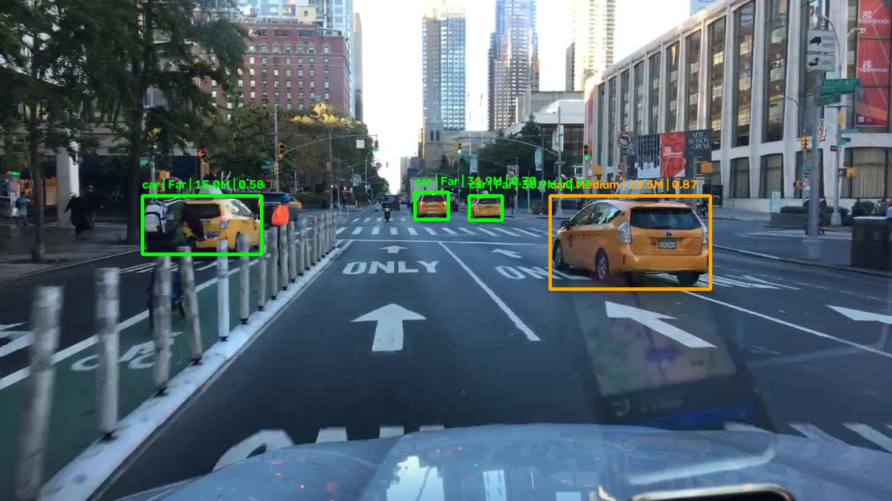

# Open Dashcam System

An open-source, lightweight dashcam system that detects nearby vehicles and road users, estimates their distance, and logs close-proximity events with the vehicle's license plate — built with pretrained YOLO26 detection and depth models, ByteTrack, and SQLite.



## Overview

The system watches a live feed and runs two models together: one detects and tracks people, bicycles, cars, motorcycles, buses, and trucks; the other estimates depth across the whole frame. For every tracked object, the median depth inside its box is measured and smoothed over time, then classified as Close, Medium, or Far. If a vehicle, bicycle, or motorcycle stays classified as Close for 5 continuous seconds, the system crops the frame, reads the license plate with EasyOCR, saves a screenshot, and logs the event.

| Class ID | Label |
|----------|-------|
| 0 | Person |
| 1 | Bicycle |
| 2 | Car |
| 3 | Motorcycle |
| 5 | Bus |
| 7 | Truck |

| Distance | Threshold | Color |
|----------|-----------|-------|
| Close | < 5m | Red |
| Medium | < 15m | Orange |
| Far | ≥ 15m | Green |

## Features

- Combined object detection and monocular depth estimation, running together on every frame
- ByteTrack object tracking, so each object keeps a consistent ID and a smoothed distance reading over time
- Exponential smoothing (alpha = 0.2) on distance readings, to avoid flickering between Close/Medium/Far on noisy depth estimates
- 5-second confirmation timer before a close-proximity event is logged, to reduce false alarms
- License plate read directly from the cropped vehicle region with EasyOCR — no separate plate detection model
- Full-frame screenshot saved on confirmed close-proximity events
- SQLite event logging — object type, plate number, screenshot path, timestamp, and confidence
- Uses pretrained YOLO26 models out of the box — no custom training required

## Project Philosophy

This project is built as an open-source, lightweight dashcam system based on simple, practical features — meant to be easy for other developers to read, modify, and extend.

**Why crop the vehicle instead of training a dedicated plate detector.** Cropping the detected vehicle and running OCR directly on that region is simpler and less complex than building and maintaining a separate license plate detection model, while still allowing the system to save an image of the vehicle together with its plate number.

**Why pretrained models instead of custom-trained ones.** Pretrained YOLO26 models were used to take advantage of their existing capabilities and performance without a training step. Other models can be added or swapped in for more customization — for example, a model that identifies a vehicle's brand or manufacturer.

**Why a 5-second confirmation rule.** The same reasoning used across the other systems in this portfolio: reduce false alarms from momentary close readings rather than logging on a single frame.

**Features considered and left out.** Traffic light state (red/yellow/green) and traffic sign recognition were both considered, but left out — they would add real complexity without much practical benefit, especially since a typical dashcam doesn't need to perform those tasks itself.

## Known Issues

- The system can sometimes count a person inside a vehicle as a separate tracked object, even though that person is already part of the detected vehicle.

## Getting Started

### Install

```bash
git clone https://github.com/<your-username>/Open-Dashcam-System.git
cd Open-Dashcam-System
pip install -r requirements.txt
```

### Run

```bash
python main.py
```

This opens your webcam (index 0) and shows the annotated feed in a window. Press `q` to quit.

Model paths and the camera index are set directly in `main.py` rather than passed as arguments — open the file and edit those values if you need different weights or a different camera source.

## Project Structure

```
Open-Dashcam-System/
├── README.md
├── LICENSE
├── requirements.txt
├── .gitignore
├── main.py                 # detection, depth estimation, tracking, OCR, and database logging
└── results/
    └── demo.jpg               # sample detection output
```

`yolo26n.pt` and `yolo26n-depth.pt` are stock pretrained models — they download automatically the first time the script runs, so they aren't included in this repo.

## How It Works

1. Runs the detection model with ByteTrack on every frame, and the depth model on the same frame, in parallel.
2. For each tracked object, samples the depth model's output within the inner region of its bounding box, takes the median, and smooths it over time (alpha = 0.2) to avoid flicker.
3. Classifies the smoothed distance as Close (< 5m), Medium (< 15m), or Far (≥ 15m) and draws a color-coded box and label.
4. If the object is a vehicle, bicycle, or motorcycle and stays Close for 5 continuous seconds, the frame is cropped around it, the plate is read with EasyOCR, a full-frame screenshot is saved, and the event is logged — once per tracked object.

## Database

`DataBase.db`, table `info`:

| Column | Type | Description |
|--------|------|-------------|
| Id | INTEGER PRIMARY KEY AUTOINCREMENT | Event ID |
| Type | TEXT | Object type (Car, Truck, Motorcycle, Bicycle) |
| Plate_Number | TEXT | OCR-read plate text, or "Unknown" if not read |
| Screenshot | TEXT | Filename of the saved screenshot |
| Date | TEXT | Timestamp the track was first seen |
| Confidence | REAL | Detection confidence |

## Tech Stack

YOLO26, Ultralytics, ByteTrack, OpenCV, EasyOCR, SQLite

## Limitations

- A person inside a vehicle can sometimes be tracked as a separate object from the vehicle itself (see Known Issues)
- Depth estimates are monocular and approximate, not measured distance — accuracy depends on the depth model's own limitations
- The 5-second timer assumes continuous tracking; if tracking briefly drops the object, the timer resets
- Plate OCR accuracy depends on plate visibility, angle, and image resolution
- Camera index and file paths are hardcoded in `main.py`
- Screenshots and `DataBase.db` are generated at runtime and aren't part of the repo

## License

MIT — see [LICENSE](LICENSE) for details.